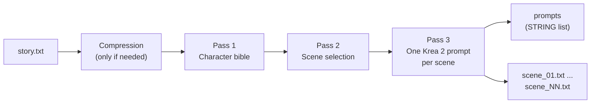

# Story → Krea 2 Prompt Batch

**A ComfyUI custom node that turns a story into a batch of Krea 2 image prompts — using a local, uncensored GGUF LLM. No cloud API. No key. No network calls.**


Point it at a `.txt` story, tell it how many images you want, and it generates one long-form natural-language prompt per key visual moment — with consistent recurring characters, LoRA trigger words woven into the prose, and both in-graph and on-disk output.

---

## Features

- 📖 **Story in, prompt batch out** — the LLM reads the whole story and picks the most visually compelling moments itself. Short story? You get fewer prompts, never filler.
- 🧠 **Local LLM engine** — GGUF models via `llama-cpp-python`, resident in memory between runs (loads once, reloads only when settings change). Thinking models supported — `<think>` blocks are stripped automatically.
- 🎭 **Character/setting bible** — recurring characters and locations get one consistent visual description reused across every prompt, so the batch looks coherent even though Krea 2 has no memory between generations.
- 🔗 **LoRA trigger words** — define them once in the map; they're woven naturally into the prose of every scene that character appears in (never appended as tags), and verified after generation.
- 🎨 **Style presets dropdown** — 10 SFW + 5 NSFW styles, a per-scene "infer" mode, or free-text custom.
- ✍️ **Prompt-enhancer system instructions** — editable on the node: priority rules, uncensored NSFW handling, and the Krea 2 prose formula (`[Subject] + [Action/Pose] + [Scene/Location] + [Lighting] + [Color] + [Composition & Camera] + [Style/Medium]`) — flowing prose, never keyword tags.
- 📦 **Dual output** — a STRING list for direct in-graph batching *and* numbered `.txt` files on disk.
- 🛡️ **Robust by design** — automatic chunk-and-summarize compression for stories bigger than the context window, format-retry and chunk fallback for stubborn models, label/markdown scrubbing, interrupt support, and a progress bar.

## How it works



1. **Compression** *(only when needed)* — stories that won't fit the context budget are chunk-summarized (map-reduce, up to 3 rounds) while preserving names and visual detail.
2. **Bible pass** — the LLM extracts recurring characters/settings and writes one reusable description each; your `character_lora_map` entries merge in and win on conflict.
3. **Scene pass** — the LLM selects up to `num_prompts` key visual moments in chronological order.
4. **Prompt pass** — one call per scene writes the final prompt as coherent prose, with the bible descriptions and trigger words applied.

## Installation

```
cd ComfyUI/custom_nodes
git clone https://github.com/<your-username>/Story_Prompts_Node
pip install -r Story_Prompts_Node/requirements.txt
```

Install against **ComfyUI's own Python**. On Windows portable builds, from the folder containing `python_embeded`:

```
.\python_embeded\python.exe -m pip install -r .\ComfyUI\custom_nodes\Story_Prompts_Node\requirements.txt
```

Restart ComfyUI — the node appears in search as **"Story → Krea 2 Prompt Batch"** (category `prompt/story`).

### GPU builds of llama-cpp-python

`pip install llama-cpp-python` builds **CPU-only** by default. For NVIDIA GPU offload install a prebuilt CUDA wheel:

```
pip install llama-cpp-python --extra-index-url https://abetlen.github.io/llama-cpp-python/whl/cu124
```

(pick the index matching your CUDA version — cu121 / cu122 / cu124; macOS default build already supports Metal). With a CPU-only build, set `gpu_layers` to `0`.

## Recommended models

Put **GGUF** models in `ComfyUI/models/LLM/` (created automatically on first launch).

Use an **instruct-tuned, uncensored ("abliterated"/HERETIC) model** — a standard aligned model can refuse or water down individual scenes partway through an unattended batch, while an uncensored variant writes every prompt it's asked for.

| Model | Notes |
|---|---|
| [DavidAU Qwen3.5-9B HERETIC UNCENSORED](https://huggingface.co/DavidAU/Qwen3.5-9B-Claude-4.6-OS-Auto-Variable-HERETIC-UNCENSORED-THINKING-MAX-NEOCODE-Imatrix-GGUF) **(recommended)** | The same model artfat's LLM prompter recommends. Fully uncensored **thinking model** — grab the `Q4_K_M` quant (~6.8 GB) and raise `max_tokens_per_prompt` to ~600–800 (reasoning spends from that budget; the node strips the think blocks automatically). |
| [mlabonne Llama-3.1-8B-Instruct abliterated](https://huggingface.co/mlabonne/Meta-Llama-3.1-8B-Instruct-abliterated-GGUF) | Lighter, non-thinking alternative (~4.9 GB, `meta-llama-3.1-8b-instruct-abliterated.Q4_K_M.gguf`) — faster, default token budget is fine. |

[huihui-ai](https://huggingface.co/huihui-ai) also maintains abliterated builds of most major model families. Keep whatever you pick instruct-tuned — base models ramble.

> **Note:** Unlike artfat's node there is no chat-handler dropdown (the GGUF's embedded chat template is used automatically) and no `mmproj` file is needed — this node is text-only. Newer model families (Qwen 3.5, etc.) need an up-to-date `llama-cpp-python`; if a model fails with **"unknown model architecture"**, upgrade it: `python_embeded\python.exe -m pip install -U llama-cpp-python`.

## Quick start

1. Copy `examples/sample_story.txt` into `ComfyUI/input/`.
2. Add the node (search "story"), pick the story and your GGUF model (press **R** to refresh dropdowns after adding files).
3. Set `num_prompts` and press **Queue**. Nothing needs to be connected — the node runs standalone and writes files to `output/story_prompts/`.
4. Watch progress under the `[StoryPromptBatch]` tag in the console.

### Wiring into a Krea 2 workflow

Connect the **`prompts`** output to a `CLIP Text Encode` node's `text` input (right-click the encode node → convert `text` widget to input). Because `prompts` is a **list**, every downstream node runs once per prompt — one queue press renders the whole batch. Load your Krea 2 checkpoint and any LoRAs from your map with normal `Load LoRA` nodes; the trigger words are already in the prose.

Prefer file-based batching? Point any prompts-from-directory loader at `output_dir` — the files are always written as well (reruns overwrite).

## Node reference

### Inputs

| Widget | What it does |
|---|---|
| `story_file` | `.txt` picked from `ComfyUI/input/` (subfolders included) |
| `num_prompts` | How many prompts to generate (1–200) |
| `gguf_model` | GGUF from `ComfyUI/models/LLM/` |
| `context_length` | llama.cpp `n_ctx` — longer stories / more prompts need more |
| `gpu_layers` | `-1` = all layers on GPU, `0` = CPU only |
| `temperature`, `top_p`, `top_k`, `repeat_penalty` | Sampling for the prompt-writing pass (analysis passes run at ≤ 0.5 temperature automatically) |
| `max_tokens_per_prompt` | Length cap per prompt — thinking models need 600+ |
| `seed` | Fix to reproduce a batch; each scene derives its own sub-seed |
| `style_medium` | Style preset dropdown — 10 SFW + 5 NSFW options, "none" = infer per scene, "custom" = use `style_custom` |
| `style_custom` | Free-text style, used only with the custom option |
| `character_lora_map` | One line per recurring character/setting — see below |
| `system_instructions` | The prompt-enhancer rules sent to the LLM — pre-filled, editable |
| `output_dir` / `filename_prefix` | Where/how the `.txt` files are written (reruns overwrite) |
| `enable` | Off = skip the LLM and return the previous batch instantly |

### Outputs

| Output | Type | Description |
|---|---|---|
| `prompts` | STRING list | Generated prompts in story order |
| `prompt_count` | INT | Actual number generated |
| `character_bible` | STRING | The resolved descriptions used across the batch |
| `saved_paths` | STRING list | Paths of the written files |

### The `character_lora_map`

One entry per line, pipe-delimited — everything after the name is optional, `#` starts a comment, malformed lines are skipped with a warning:

```
Name | lora_filename.safetensors | trigger word | visual description
```

A detailed example (the node's map field ships with these as a commented template — delete the leading `#` to activate a line):

```
Lena | lena_flux_v3.safetensors | lena_v3 | a curvy young woman in her mid-20s with long platinum-blonde hair, blue eyes, a small star tattoo on her left collarbone, and a fitted black slip dress
Marcus | | | a tall broad-shouldered man with a trimmed dark beard, a buzz cut, and a gray henley with rolled-up sleeves
Neon Loft | loft_env_v1.safetensors | neonloft | a downtown loft at night with exposed brick, pink-and-blue neon signs, and rain-streaked floor-to-ceiling windows
```

- **Description given** → used verbatim in every scene that character appears in.
- **Description blank** → the LLM writes one from the story and keeps it consistent.
- **Trigger given** → woven naturally into the prose of each of that character's scenes; if the LLM drops it, the node prepends it so the LoRA still fires.
- **Empty map** → fine; the LLM still builds its own bible from the story for batch consistency.

The more specific the description — age, build, hair, eyes, distinguishing marks, signature clothing — the more consistent the character looks across the whole batch.

## Troubleshooting

| Symptom | Fix |
|---|---|
| Node missing after restart / `llama-cpp-python is not installed` | Requirements were installed into the wrong Python — use the `python_embeded` command from Installation |
| Scenes come back refused or watered down | You're on a standard aligned model — switch to an uncensored/abliterated GGUF |
| Thinking model returns empty prompts | Its reasoning ate the token budget — raise `max_tokens_per_prompt` to 600+ |
| `unknown model architecture` on load | `llama-cpp-python` predates the model family — upgrade it |
| Out of VRAM | Lower `gpu_layers` (0 = CPU), use a smaller quant, or generate prompts first and flip `enable` off while rendering images |
| Empty dropdowns | Stories go in `ComfyUI/input`, models in `ComfyUI/models/LLM` — press **R** to refresh |
| Rambling / keyword-list output | Use an instruct-tuned GGUF and lower `temperature` to ~0.7 |
| Fewer prompts than requested | By design — the story lacked that many distinct visual moments; nothing is padded |
| `context_length is too small` error | Raise `context_length` (e.g. 16384) or lower `num_prompts` |
| Prompts cut off mid-sentence | Raise `max_tokens_per_prompt` |

## Project structure

```
Story_Prompts_Node/
├── __init__.py                  # node registration
├── story_prompt_node.py         # the node: widgets, 3-pass pipeline, parsing, file output
├── llm_engine.py                # llama-cpp-python wrapper, resident model cache, think-stripping
├── requirements.txt
├── pyproject.toml               # ComfyUI Registry metadata
├── examples/
│   ├── sample_story.txt         # smoke-test story
│   └── character_lora_map.example.txt
└── tests/
    └── test_parsing.py          # offline tests — run with: python tests/test_parsing.py
```

## Credits

- Architecture inspired by [artfat-comfyui-llm-prompter](https://github.com/artfat-creator/artfat-comfyui-llm-prompter) (image → caption); this node is the inverse (story → prompt batch). Built from scratch.
- Prompt formatting follows Krea 2's guidance: long, descriptive, coherent natural-language prose over keyword stuffing.

## License

[MIT](LICENSE)
